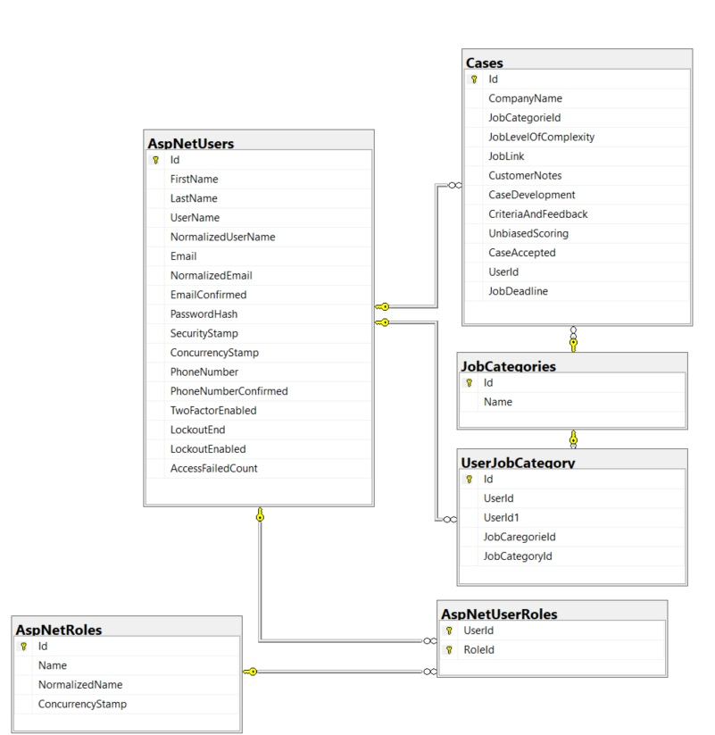

- [Login](#login)
  - [Route](#route)
  - [Arguments](#arguments)
  - [Responce](#responce)
- [Register](#register)
  - [Route](#route-1)
  - [Arguments](#arguments-1)
  - [Responce](#responce-1)
- [Confirm Email](#confirm-email)
  - [Route](#route-2)
  - [Arguments](#arguments-2)
  - [Responce](#responce-2)
- [Edit Profile](#edit-profile)
  - [Route](#route-3)
  - [Arguments](#arguments-3)
  - [Responce](#responce-3)
- [Get Profile Data](#get-profile-data)
  - [Route](#route-4)
  - [Arguments](#arguments-4)
  - [Responce](#responce-4)
- [Get Associated Cases](#get-associated-cases)
  - [Route](#route-5)
  - [Arguments](#arguments-5)
  - [Responce](#responce-5)
- [Create Case](#create-case)
  - [Route](#route-6)
  - [Arguments](#arguments-6)
  - [Responce](#responce-6)
- [Accept Case](#accept-case)
  - [Route](#route-7)
  - [Arguments](#arguments-7)
  - [Responce](#responce-7)
- [Database](#database)

# Login
## Route
`host/api/Account/login`
## Arguments
| Argument | Type   | Requirements |
| -------- | ------ | ------------ |
| Email    | string | none         |
| Password | string | none         |
## Responce
Returns code 400 on error

On success returns user role and token, code 200

# Register
## Route
`host/api/Account/register`
## Arguments
| Argument          | Type            | Requirements        |
| ----------------- | --------------- | ------------------- |
| FirstName         | string          | 6 to 30 characters  |
| LastName          | string          | 6 to 30 characters  |
| Email             | string          | none                |
| Password          | string          | none                |
| PasswordConfirm   | string          | must match password |
| UserJobCategories | List of strings | none                |
## Responce
Returns code 400 on error

On success sends email to user, returns code 200

# Confirm Email
## Route
`host/api/Account/ConfirmEmail`
## Arguments
| Argument | Type   | Requirements |
| -------- | ------ | ------------ |
| Email    | string | none         |
| Code     | string | none         |
## Responce
Returns code 400 on error

On success confirms user email, return code 200

# Edit Profile
## Route
`host/api/Account/ChangeProfile`
## Arguments
Requires token
| Argument  | Type   | Requirements       |
| --------- | ------ | ------------------ |
| FirstName | string | 6 to 30 characters |
| LastName  | string | 6 to 30 characters |
| Email     | string | none               |
## Responce
Not implemented yet
Always returns 200

# Get Profile Data
## Route
`host/api/Account/GetProfileData`
## Arguments
Requires token
| Argument | Type   | Requirements |
| -------- | ------ | ------------ |
| Email    | string | none         |
## Responce
Returns FirstName, LastName, PhoneNumber, Email, Role; code 200

# Get Associated Cases
## Route
`host/api/Cases/GetAssociatedCases`
## Arguments
Requires token
| Argument | Type   | Requirements |
| -------- | ------ | ------------ |
| Email    | string | none         |
## Responce
Returns list of cases avaliable to User

# Create Case
## Route
`host/api/Cases/CreateCase`
## Arguments
Requires token
| Argument             | Type   | Requirements |
| -------------------- | ------ | ------------ |
| CompanyName          | string | none         |
| JobCategoryId        | int    | none         |
| JobLevelOfComplexity | string | none         |
| JobLink              | string | none         |
| CustomerNotes        | string | none         |
| CaseDevelopment      | bool   | none         |
| CriteriaAndFeedback  | bool   | none         |
| UnbiasedScoring      | bool   | none         |
| CaseAccepted         | bool   | none         |
| UserId               | string | none         |
## Responce
Returns 200

# Accept Case
## Route
`host/api/Cases/AcceptCase`
## Arguments
Requires token
| Argument | Type   | Requirements |
| -------- | ------ | ------------ |
| Id       | int    | none         |
| UserId   | string | none         |
## Responce
Returns 400 on error

On success returns 200

# Database 

